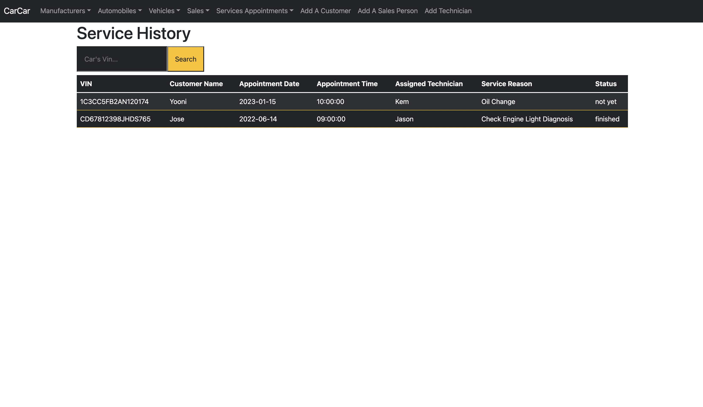
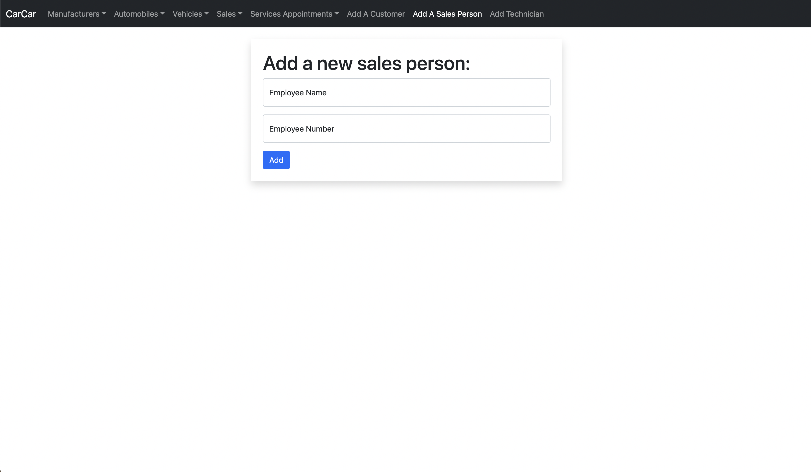

# Graphical Human Interface 
    Contains descriptions of the different screens and how they work with links to screenshots of working website for your conveniance.
    
## Home Page

The home page is the main page that users will see upon first visiting the CarCar Site. 

## Manufacturers Pages

The manufacturers page lists all manufacturers registered in the database. The add a manufacturer page has a form that allows the user to input manufacturer details to be featured on the list manufacturers page.

## Vehicles Pages

The models page lists all vehicle models registered in the database. The add a vehicle model page has a form that allows the user to input model details to be featured on the list models page.

## Automobiles Pages

The automobiles page lists all automobiles registered in the database. The add an automobile page has a form that allows the user to input automobile details to be featured on the list automobiles page.

## Sales Pages

The List All Sales page lists all automobile sales histories for all sales people registered in the database. 
The add a sale page has a form that allows the sales person to input their sale details to be featured on the list sales page. 
The Sales Person History page lists the sales history based on one singular chosen sales person.

## Service Appointments Pages

The List All Service Appointments page lists all automobile service appointment histories for all VINs registered in the database. 
The add an appointment page has a form that allows the technician to input their appointment details to be featured on the list appointments page. 
The VIN History page lists the VIN's service appointment history based on one singular chosen VIN.

## Add A Customer Page

Add a customer's information to the database to later be assigned to automobiles for sale or service appointments. 

## Add A Sales Person Page

Add a sales person's information to the employee database to later be assigned to automobile sales.

## Add A Technician Page

Add a technician's information to the employee database to later be assigned to automobile service appointments.

